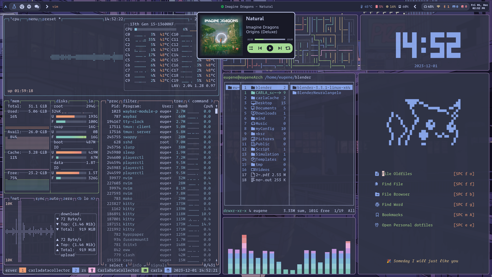
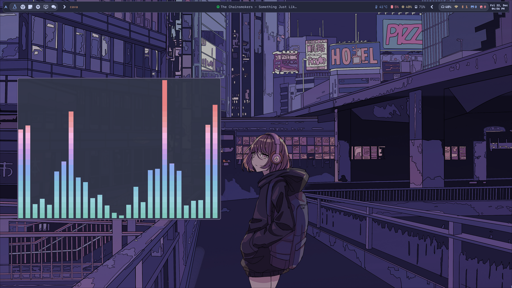
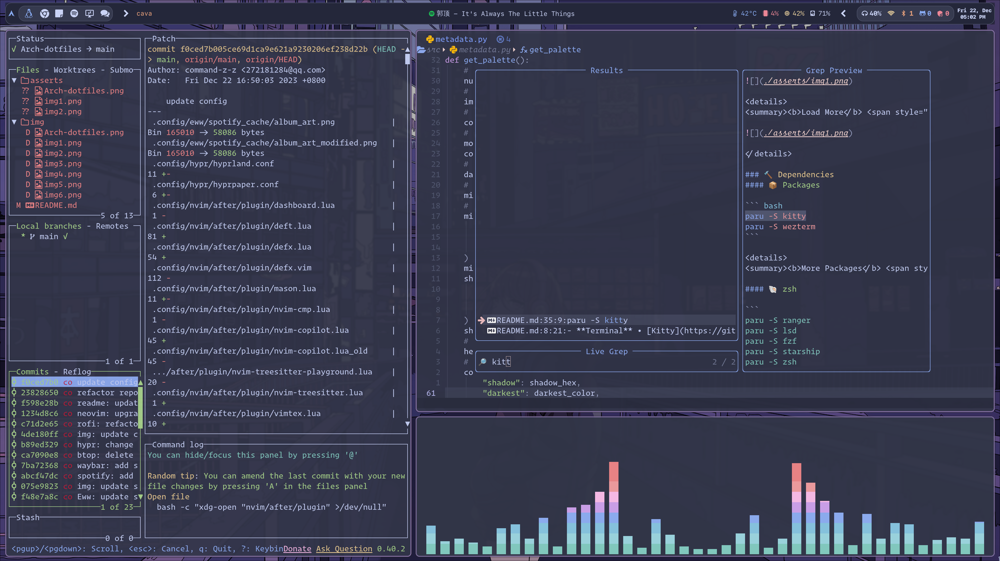

<h2>
 <b style="font-size:24px;line-height:24px;vertical-align:middle;"><i> Arch dotfiles</i></b>
</h2>

- **Window Manager** • [Hyprland](https://github.com/hyprwm/Hyprland)🎨 Tiles Manage!
- **Status Bar** • [Waybar](https://github.com/Alexays/Waybar)🧴 Highly customizable Wayland bar!
- **Widget System** • [Eww](https://github.com/elkowar/eww)🔔 ElKowars wacky widgets!
- **Terminal** • [Kitty](https://github.com/kovidgoyal/kitty) 💻 A powerful term with gpu support!
- **Shell** • [Zsh](https://www.zsh.org/) with Theme [Starship](https://github.com/starship/starship)🐚 Cross Shell Platform!
- **Application Launcher** • [Rofi](https://github.com/davatorium/rofi)🚀 Realmente rápido y customizable!
- **Notify Daemon** • [SwayNC](https://github.com/ErikReider/SwayNotificationCenter)📠 A simple GTK based notification daemon with modern UI!
- **File Manager** • [Ranger](https://github.com/ranger/ranger)📁 A VIM-inspired filemanager for the console!
- **File Manager GUI** • [Nemo](https://github.com/linuxmint/nemo)📂 File browser for Cinnamon!
- **Code Editor** • [Neovim](https://github.com/neovim/neovim)🗞️ A uUtimate editorr!
- **Music Player** • [Spicetify](https://github.com/spicetify/spicetify-cli)🎹 A Customize Spotify client!
- **Audio Visualizer** • [Cava](https://github.com/karlstav/cava)🎼 Cross-platform Audio Visualizer!
- **Terminal Multiplexing** • [Tmux](https://github.com/tmux/tmux)🎯 A Terminal multiplexer!
- **Theme** • [Catppuccin](https://github.com/catppuccin/catppuccin)🌿 My favourite Theme!

### 🐜 ScreenShot



<details>
<summary><b>Load More</b> <span style="font-size:14px;">(Click to expend) </span> </summary>




</details>

### 🔨 Dependencies
#### 📦 Packages

``` bash
paru -S kitty
```

<details>
<summary><b>More Packages</b> <span style="font-size:14px;">(Click to expend) </span> </summary>

#### 🐚 zsh

```
paru -S ranger
paru -S lsd
paru -S fzf
paru -S starship
paru -S zsh
sh -c "$(wget -O- https://raw.githubusercontent.com/ohmyzsh/ohmyzsh/master/tools/install.sh)"
```
#### 🎵 Music

```
paru -S cava
paru -S spotify
paru -S spicetify-cli
paru -S spotify-tui
```
#### 🤿 Neovim & Tmux

```
paru -S ripgrep
paru -S neovim
paru -S tmux
```
#### Other 

```
paru -S bat
paru -S btop
paru -S lazygit
paru -S neofetch
paru -S qutebrowser
```

</details>

### 🚀 Manual Installation

1.Clone this repository with some related repositories.

```
git clone https://github.com/command-z-z/Arch-dotfiles --recursive
```

2.See my `Dependencies` to learn more about my config.

3.Install the required software(see [Dependencies](#-dependencies)).

4.Just copy the piece of code you really want.

>⚠️Note :Please understand that this is my personal configuration for my setup. If something doesn't work, feel free to open up an issue or message me, and I will try to help. However, before doing that, make sure you read the error output, use some common sense, and try to solve the problem yourself if it is something simple.

### 🔒 Archive

> [neovim](https://github.com/neovim/neovim) configuration has been removed from this repository, please refer to the my personal neovim repository [here](https://github.com/command-z-z/EugeneVim).

### ©️ Credits

Beauty community:[r/unixporn](https://www.reddit.com/r/unixporn/)

© repo:[command-z-z/dotfile](https://github.com/command-z-z/dotfiles)
© repo:[khaneliman/dotfile](https://github.com/khaneliman/dotfiles)
